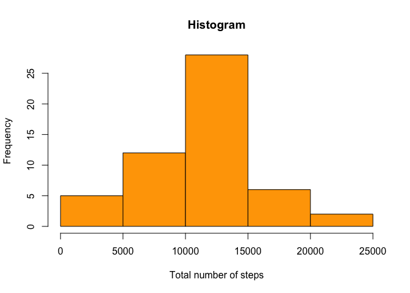
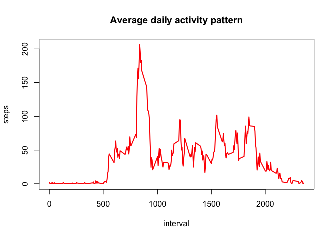
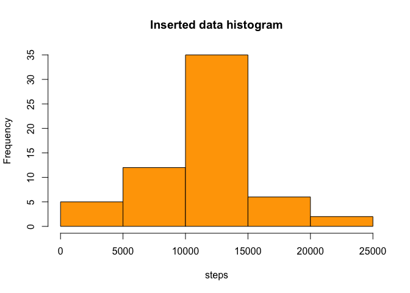
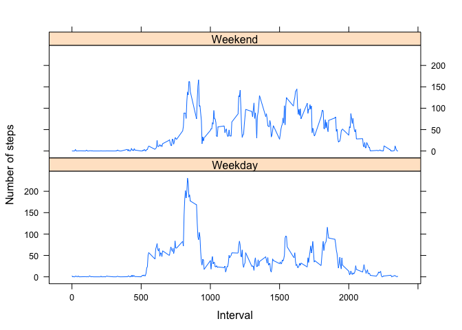

# Reproducible Research: Peer Assessment 1


## Loading and preprocessing the data

```r
dir<-getwd()
setwd(dir)
data_file<-unzip("activity.zip")
data<-read.csv("activity.csv")

#remove all NAs
clean_data<-subset(data,is.na(data$steps)==FALSE)
meanstep<-aggregate(steps~date,clean_data,sum)
```


## What is mean total number of steps taken per day?

```r
hist(meanstep$steps,col="orange",xlab="Total number of steps",main="Histogram")
```

<!-- -->

The mean total number of steps is 

```r
mean(meanstep$steps) 
```

```
## [1] 10766.19
```
and the median is 

```r
median(meanstep$steps) 
```

```
## [1] 10765
```

## What is the average daily activity pattern?


```r
daily_act<-aggregate(steps~interval,clean_data,mean)
plot(daily_act$interval,daily_act$steps,xlab="interval",ylab="steps",col="red",pch=19,type="l",lwd=2,main="Average daily activity pattern")
```

<!-- -->


```r
ind_max<-which.max(daily_act$steps)
daily_act[ind_max,]
```

```
##     interval    steps
## 104      835 206.1698
```

The interval with the maximum average number of steps (206.2) is 835.


## Imputing missing values


```r
dim(subset(data,is.na(data$steps)==TRUE))[[1]]
```

```
## [1] 2304
```

The number of rows with missing data is 2304.


```r
for(i in 1:nrow(clean_data)){
 if(is.na(data$steps[i])){
   interval_num<-data$interval[i]
   index<-which(daily_act$interval==interval_num)
   steps_num<-daily_act$steps[index]
   data$steps[i]<-steps_num
 } 
}
```


```r
new_data<-aggregate(steps~date,data,sum)
hist(new_data$steps,col="orange",main="Inserted data histogram",xlab="steps")
```

<!-- -->

```r
mean(new_data$steps)
```

```
## [1] 10766.19
```

```r
median(new_data$steps)
```

```
## [1] 10766.19
```

There is no difference in the mean but the median appears to be slightly higher than before. 

## Are there differences in activity patterns between weekdays and weekends?


```r
days<-weekdays(as.Date(data$date))
weekday<-vector()

for(i in 1:length(days)){
  if(days[i]=="Saturday" || days[i]=="Sunday"){
    weekday[i]<-"Weekend"
  }else{
    weekday[i]<-"Weekday"
  }
}

data$day<-weekday
new_clean_data<-na.omit(data)
steps_day<-aggregate(steps~interval+day,new_clean_data,mean)
library(lattice)
xyplot(steps~interval|day,steps_day,type="l",layout=c(1,2),xlab="Interval",ylab="Number of steps")
```

<!-- -->
